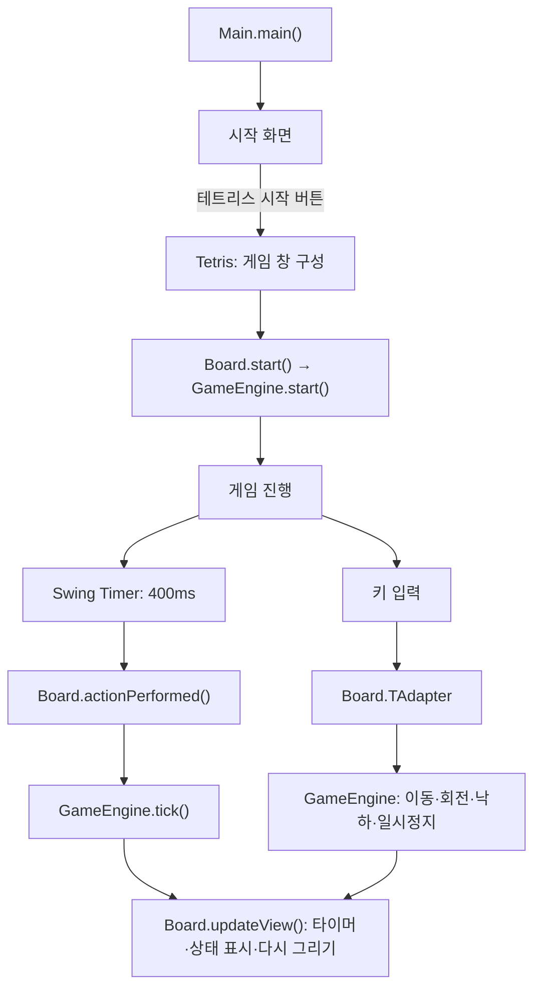

# Tetris

Java Swing으로 구현한 데스크톱 테트리스입니다. 소스코드분석 프로젝트로 기존 게임의 구조를 분석하고, 화면과 게임 규칙을 분리하며 기능을 개선하고 있습니다.

## 주요 기능

- 시작 화면의 **테트리스 시작** 버튼으로 게임에 진입합니다.
- 10 × 22칸 보드에서 7종의 테트로미노가 무작위로 생성됩니다.
- 블록은 400ms 간격으로 자동 하강하며, 이동·회전·한 칸 하강·즉시 낙하를 지원합니다.
- 보드 경계와 고정된 블록의 충돌을 검사하고, 가득 찬 줄을 제거합니다.
- 하단 상태 표시줄에 누적 제거 줄 수, 일시정지 상태, 게임 종료 상태를 표시합니다.
- 창 크기에 맞춰 블록을 정사각형으로 그리며 보드를 가운데 배치합니다.

## 실행 방법

### 요구 환경

- **JDK 8 이상**: IntelliJ 프로젝트 설정은 Java 8을 기준으로 합니다. 컴파일은 OpenJDK 17에서 확인했습니다.
- **그래픽 데스크톱 환경**: Swing 창을 표시할 수 있어야 합니다.
- 외부 라이브러리나 데이터베이스는 필요하지 않습니다. Maven·Gradle 설정 없이 JDK로 직접 컴파일합니다.

### 터미널에서 실행하기

macOS 또는 Linux 터미널에서 아래 명령을 실행합니다.

```bash
git clone https://github.com/dev-samuel-codes/Tetris.git
cd Tetris
mkdir -p out
javac -encoding UTF-8 -d out src/frontend/*.java src/frontend/engine/*.java
java -cp out frontend.Main
```

이미 저장소를 내려받았다면 프로젝트 루트에서 `mkdir -p out`부터 실행합니다. 시작 화면이 나타나면 **테트리스 시작** 버튼을 누릅니다.

`out/`은 컴파일 결과가 저장되는 폴더이며 Git 추적에서 제외되어 있습니다.

### IntelliJ IDEA에서 실행하기

1. 프로젝트 폴더를 엽니다.
2. Project SDK를 설치된 JDK로 지정하고, `src`가 Sources Root로 설정되어 있는지 확인합니다.
3. `src/frontend/Main.java`의 `main()`을 실행합니다.

실행 진입점은 **`frontend.Main`**입니다. `Tetris` 클래스는 게임 창을 구성하며 별도의 `main()`을 갖고 있지 않습니다.

## 조작키

| 키 | 동작 |
| --- | --- |
| `←` | 왼쪽으로 한 칸 이동 |
| `→` | 오른쪽으로 한 칸 이동 |
| `↑` | 왼쪽 회전 (`rotateLeft`) |
| `↓` | 오른쪽 회전 (`rotateRight`) |
| `D` / `d` | 아래로 한 칸 이동 |
| `Space` | 가능한 가장 아래 위치까지 즉시 낙하 |
| `P` / `p` | 일시정지 / 재개 |

**아래 방향키는 회전 키입니다.** 한 칸 하강에는 `D`를 사용합니다. 키 입력이 반응하지 않으면 게임 보드를 클릭해 포커스를 준 뒤 다시 입력합니다.

## 프로젝트 구조

```text
src/
└── frontend/
    ├── Main.java              # 시작 화면과 앱 진입점
    ├── Tetris.java            # 게임 창과 화면 배치
    ├── Board.java             # 입력·타이머·보드 렌더링
    ├── SidePanel.java         # 오른쪽 정보 패널 영역
    ├── BlockPainter.java      # 블록 색상과 입체 테두리 그리기
    ├── Shape.java             # 블록 좌표와 회전 연산
    ├── Tetrominoes.java       # 빈 칸과 7종 블록의 열거형
    └── engine/
        └── GameEngine.java    # 게임 상태·충돌·고정·줄 제거
tetris2026.iml                 # IntelliJ 모듈 설정
```

### 클래스별 역할

| 클래스 | 역할 |
| --- | --- |
| `Main` | Swing 이벤트 디스패치 스레드에서 시작 화면을 열고, 버튼 입력으로 게임 창으로 전환합니다. |
| `Tetris` | `Board`, `SidePanel`, 하단 상태 표시줄을 배치하고 게임을 시작합니다. |
| `Board` | 키 입력과 Swing 타이머를 엔진에 전달하고, 엔진 상태를 조회해 보드와 상태 표시줄을 갱신합니다. |
| `GameEngine` | 게임 시작·일시정지, 현재 블록과 보드 상태, 이동·회전·충돌, 블록 고정·줄 제거·게임 종료를 관리합니다. |
| `Shape` | 블록을 구성하는 네 칸의 상대 좌표를 저장하고, 무작위 도형 선택과 회전 연산을 제공합니다. |
| `Tetrominoes` | `NoShape`와 Z·S·I·T·O·L·J에 해당하는 일곱 도형을 정의합니다. |
| `BlockPainter` | 도형별 색상을 선택하고 한 칸의 블록을 그립니다. |
| `SidePanel` | 현재는 어두운 배경의 패널 영역을 제공합니다. |

### 실행 흐름



게임 규칙과 상태는 `GameEngine`으로 분리되어 있으며, Swing 타이머와 화면 갱신은 `Board`에서 관리합니다. 엔진은 `frontend` 패키지의 `Shape`와 `Tetrominoes`를 사용합니다.

## 현재 구현 범위

- **오른쪽 정보 패널**: 화면 영역만 마련되어 있습니다. 점수와 다음 블록 미리보기는 아직 표시하지 않습니다.
- **점수 표시**: 하단 숫자는 누적 제거 줄 수입니다. 별도의 점수·레벨 계산은 구현되어 있지 않습니다.
- **게임 종료**: 새 블록을 생성 위치에 배치할 수 없으면 `game over`를 표시하고 타이머를 멈춥니다. 재시작 버튼은 없으므로 다시 플레이하려면 앱을 재실행합니다.
- **확장 기능**: 멀티플레이, 보스 모드, AI, 홀드, 고스트 블록, 벽 차기(Wall Kick)는 현재 소스에 구현되어 있지 않습니다.

## 개발 시 참고

- 게임 규칙을 수정할 때는 `GameEngine`, 입력이나 화면 동작을 수정할 때는 `Board`를 우선 확인합니다.
- 블록은 `Shape`의 `int[4][2]` 좌표와 네 칸을 순회하는 코드로 표현됩니다. 칸 수가 다른 특수 블록을 추가하려면 좌표 표현과 엔진·렌더링의 순회 로직을 함께 변경해야 합니다.
- 고정된 보드는 1차원 배열에 저장되며, `(x, y)` 좌표는 `y * BOARD_WIDTH + x`로 접근합니다. 화면을 그릴 때는 위아래 방향을 변환합니다.
- 자동화된 테스트는 아직 포함되어 있지 않습니다. 변경 후 컴파일을 확인하고, 게임 화면에서 이동·회전·낙하·줄 제거·일시정지·게임 종료를 확인합니다.
