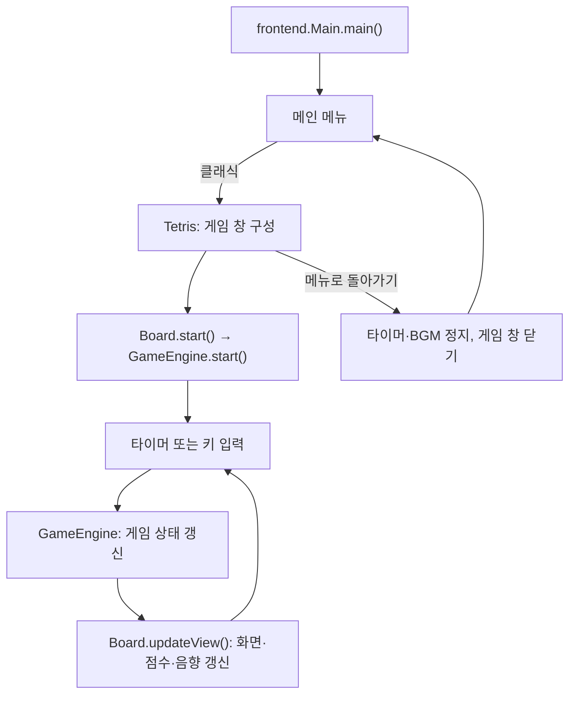

# Tetris

Java Swing으로 구현한 데스크톱 테트리스입니다. 소스코드분석 프로젝트로 기존 게임의 구조를 분석하고, 화면과 게임 규칙을 분리하며 기능을 개선하고 있습니다.

## 주요 기능

- 메인 메뉴에서 닉네임을 입력하고 **적용**한 뒤 **클래식** 게임을 시작합니다. 아이템·멀티플레이 게임은 준비 중입니다.
- 클래식은 10 × 22칸 보드에서 7종의 블록을 이동·회전·낙하시켜 가득 찬 줄을 제거하는 게임입니다.
- 오른쪽 패널에 점수, 누적 제거 줄 수, 경과 시간, 다음 블록, 조작키를 표시합니다.
- 한 번에 지운 줄 수와 연속 줄 제거에 따라 점수가 오르며, 점수가 높아지면 자동 낙하 간격이 400ms에서 최대 200ms까지 짧아집니다.
- 게임 중 배경음악과 줄 제거·게임 종료 효과음을 재생합니다.
- `P` 키로 일시정지·재개하며, 일시정지와 게임 종료 상태를 보드 위에도 표시합니다.
- **메뉴로 돌아가기** 버튼을 누르면 게임 타이머와 배경음악을 정지하고 메인 메뉴로 이동합니다.
- 게임 종료 시 TCP 서버에 닉네임별 최고 점수를 저장합니다. 메인 메뉴에는 내 최고 점수, 랭킹에는 전체 플레이어의 최고 점수를 5명씩 표시합니다.
- 서버 연결이 끊기면 `.tetris/scores.properties`에 전송 대기 점수를 보관합니다. 앱 실행 중 30초 간격으로 재시도하며, 메뉴 조회와 다음 실행에서도 다시 전송합니다.
- 랭킹의 **이전·다음·새로고침** 버튼으로 다른 컴퓨터에서 올린 기록도 확인합니다. 진행 중 메뉴로 나간 게임의 점수는 저장하지 않습니다.
- 설정에서 다음 게임의 초기 크기를 선택합니다. 게임 창의 크기를 변경해도 가로·세로 비율과 블록의 정사각형 모양을 유지합니다.

## 실행 방법

### 요구 환경

- **JDK 8 이상** 및 Swing 창을 표시할 수 있는 그래픽 데스크톱 환경
- 외부 라이브러리나 데이터베이스 없이 JDK로 직접 컴파일합니다.

### 터미널에서 실행하기

저장소를 내려받은 뒤 프로젝트 루트에서 실행합니다. macOS 또는 Linux 기준입니다.

```bash
mkdir -p out
find src -name '*.java' -print0 | xargs -0 javac -encoding UTF-8 -d out
cp -R src/frontend/audio out/frontend/
java -cp out frontend.Main
```

하위 폴더의 소스까지 함께 컴파일하고, 오디오 파일을 실행 경로에 복사합니다. 닉네임을 적용한 뒤 **클래식** 버튼을 누릅니다. `out/`은 컴파일 결과가 저장되는 폴더이며 Git 추적에서 제외되어 있습니다.

기본 점수 서버는 `131.186.39.107:5000`입니다. 다른 서버나 로컬 테스트 서버를 사용하려면 다음과 같이 지정합니다.

```bash
java -Dtetris.server.host=127.0.0.1 -Dtetris.server.port=5000 -cp out frontend.Main
```

클라이언트의 프로필·임시 점수 폴더는 `-Dtetris.data.dir=/원하는/폴더`로 변경할 수 있습니다. 같은 컴퓨터에서 여러 클라이언트를 시험할 때는 각각 다른 폴더를 지정합니다.

### IntelliJ IDEA에서 실행하기

1. 프로젝트 폴더를 열고 Project SDK를 설치된 JDK로 지정합니다.
2. `src`가 Sources Root인지 확인합니다.
3. `src/frontend/Main.java`의 `main()`을 실행합니다.
4. 배경음악이 나오지 않으면 빌드 출력에 `frontend/audio/*.wav`가 복사되는지 확인합니다.

게임 앱의 실행 진입점은 **`frontend.Main`**입니다. `Tetris`는 게임 창을 구성하며 별도의 `main()`은 없습니다.

## 조작키

| 키 | 동작 |
| --- | --- |
| `←` / `→` | 왼쪽 / 오른쪽으로 한 칸 이동 |
| `↑` | 왼쪽 회전 (`rotateLeft`) |
| `↓` | 오른쪽 회전 (`rotateRight`) |
| `D` / `d` | 아래로 한 칸 이동 |
| `Space` | 가능한 가장 아래 위치까지 즉시 낙하 |
| `P` / `p` | 일시정지 / 재개 |

**아래 방향키는 회전 키입니다.** 한 칸 하강에는 `D`를 사용합니다.

## 프로젝트 구조

```text
src/
├── frontend/
│   ├── Main.java                 # 앱 진입점, 메인·멀티플레이·랭킹·설정 메뉴
│   ├── Tetris.java               # 게임 창, 비율 유지, 메뉴 복귀
│   ├── Board.java                # 입력·타이머·보드 렌더링·상태 표시
│   ├── SidePanel.java            # 점수·시간·제거 줄·다음 블록·조작키
│   ├── BlockPainter.java         # 공통 블록 색상과 그라데이션 렌더링
│   ├── Shape.java                # 블록 좌표와 회전 연산
│   ├── Tetrominoes.java          # 빈 칸과 7종 블록의 열거형
│   ├── GameSettings.java         # 선택한 게임 창 크기
│   ├── Resolution.java           # 작게·보통·크게 크기 설정
│   ├── ScoreManager.java         # 서버 점수 동기화·비동기 조회·재전송
│   ├── SoundManager.java         # 배경음악·효과음 재생
│   ├── audio/                    # WAV 오디오 리소스
│   ├── style/
│   │   └── Style.java            # 공통 폰트·화면 색상·버튼 스타일
│   ├── engine/
│   │   └── GameEngine.java       # 게임 상태·점수·충돌·고정·줄 제거
│   ├── score/
│   │   └── LocalScoreStore.java  # 닉네임·로컬 최고 점수·전송 대기 기록
│   └── network/
│       ├── ScoreClient.java      # TCP 점수 등록·조회·랭킹 요청
│       └── ConnectionTestClient.java  # PING 연결 확인용 클라이언트
└── backend/
    ├── score/
    │   └── ScoreRepository.java  # 최고 점수 영속 저장·정렬·페이지 조회
    └── network/
        ├── ScoreServer.java      # TCP 점수 서버 진입점
        └── ConnectionTestServer.java # 기존 명령과 호환되는 진입점
```

`src/kr`에 있던 화면 개선은 `frontend`에 통합하고 중복 소스는 제거했습니다. 게임 규칙은 `frontend.engine.GameEngine`, 화면과 입력은 `frontend`에서 관리합니다. 엔진은 `frontend`의 `Shape`와 `Tetrominoes`를 사용합니다.

### 실행 흐름



## 현재 구현 범위

- 클래식, 서버 점수·전체 랭킹, 해상도 설정, 오디오, 메뉴 복귀를 지원합니다.
- 아이템, 1PC 2인, AI 대전, 온라인 PVP는 아직 게임에 연결되어 있지 않습니다.
- 서버는 파일 기반 저장소를 사용합니다. 계정 인증, 게임방·매칭·대전 상태 동기화, DB 연동은 아직 없습니다.
- 홀드, 고스트 블록, 벽 차기(Wall Kick)는 구현되어 있지 않습니다.

## 서버 점수 저장과 운영

### 점수 서버 실행

위의 컴파일을 마친 뒤 서버 컴퓨터에서 실행합니다. 서버에는 그래픽 환경이 필요하지 않습니다.

```bash
java -cp out backend.network.ScoreServer 5000 server-data
```

서버는 `0.0.0.0:5000`에서 접속을 받고 `server-data/scores.tsv`에 저장합니다. 첫 번째 인자는 포트, 두 번째 인자는 저장 폴더입니다. 기존 `backend.network.ConnectionTestServer` 실행 명령도 점수 서버로 연결됩니다.

현재 개인 서버의 작업 폴더는 `/home/samuel/server/tetris-network-check`이며, 점수는 그 아래 `server-data/scores.tsv`에 저장됩니다. 해당 작업 폴더는 Docker 볼륨에 연결되어 있습니다. 다른 배포 환경에서도 저장 폴더를 볼륨에 연결해야 컨테이너를 교체할 때 기록을 유지할 수 있습니다.

점수 파일 보존과 Java 프로세스 자동 실행은 별개입니다. 현재 컨테이너의 시작 명령은 SSH 서버이므로 컨테이너를 재시작하면 점수 서버도 다시 실행해야 합니다. 자동 실행은 서버 노트북의 Docker 시작 설정에 위 명령을 등록해야 합니다.

### 닉네임과 저장 규칙

- 닉네임은 문자·숫자·`_`·`-`를 사용해 1~16자로 입력합니다. 한글을 지원하고 대소문자는 구분합니다.
- 같은 닉네임은 같은 플레이어로 취급합니다. 현재는 로그인 인증 없이 닉네임으로 구분하며, 클라이언트가 보낸 점수를 저장합니다.
- 더 높은 점수만 갱신합니다. 낮은 점수나 같은 점수를 다시 보내도 최고 점수가 내려가거나 랭킹 행이 중복되지 않습니다.
- 점수 내림차순으로 정렬하고, 동점이면 닉네임 순으로 표시합니다. 서버는 최대 10,000개의 닉네임을 저장합니다.
- 서버가 파일 저장을 마친 뒤 성공 응답을 보내며, 클라이언트는 이 응답을 받은 점수만 전송 대기 목록에서 제거합니다.
- 서버가 꺼져 있어도 플레이할 수 있습니다. 저장에 실패하면 게임 하단에 **재전송 대기** 또는 **저장 실패**를 표시하고, 자세한 내용은 해당 상태 표시의 툴팁으로 확인합니다.
- 기존 `scores.txt`는 닉네임 정보가 없어 자동으로 업로드하지 않습니다. 파일은 보존하고 새로 플레이한 기록부터 동기화합니다.
- `.tetris/`와 `server-data/`는 Git 추적에서 제외합니다.

### TCP 요청

접속 직후 `TETRIS/1 READY`를 받고, 줄바꿈으로 끝나는 요청 하나를 전송합니다. 닉네임 토큰은 NFC로 정규화한 UTF-8 닉네임의 패딩 없는 URL-safe Base64입니다.

| 요청 | 응답 |
| --- | --- |
| `PING` | `PONG` |
| `BEST <닉네임 토큰>` | `BEST <최고 점수>` |
| `SUBMIT <닉네임 토큰> <점수>` | `OK <저장된 최고 점수>` |
| `RANKING <시작 위치> <개수>` | `RANKING <전체 인원> <응답 개수>`, `ROW <순위> <닉네임 토큰> <점수>` 행들, 마지막 `END` |

랭킹 시작 위치는 0부터이며 한 번에 1~100명을 조회합니다. 잘못된 요청은 `ERROR <오류 코드>`로 응답합니다. 기존 연결 확인도 그대로 사용할 수 있습니다.

```bash
java -cp out frontend.network.ConnectionTestClient 131.186.39.107 5000
```

## 개발 시 참고

- 게임 규칙을 수정할 때는 `GameEngine`, 입력·타이머·화면 동작은 `Board`를 먼저 확인합니다.
- 공통 화면 색상·폰트·버튼은 `Style`, 블록 색상과 그리기는 `BlockPainter`에서 관리합니다.
- `Shape`는 네 칸의 상대 좌표를 저장합니다. 고정된 보드는 1차원 배열이며, `(x, y)` 좌표는 `y * BOARD_WIDTH + x`로 접근합니다.
- 향후 분리하면 좋을 메뉴 패널, 타이머 관리, 보드 렌더링, 키 안내 관리는 해당 코드에 주석으로 남겨 두었습니다.
- 변경 후에는 컴파일과 함께 메뉴 이동·설정·랭킹·이동·회전·낙하·줄 제거·일시정지·게임 종료·창 크기 변경을 확인합니다.
