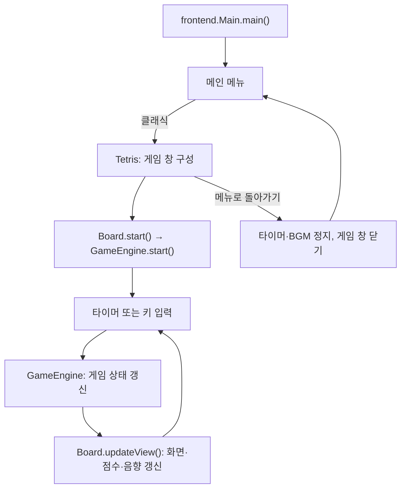

# Tetris

Java Swing으로 구현한 데스크톱 테트리스입니다. 소스코드분석 프로젝트로 기존 게임의 구조를 분석하고, 화면과 게임 규칙을 분리하며 기능을 개선하고 있습니다.

## 주요 기능

- 메인 메뉴에서 **클래식**, **아이템**, **멀티플레이** 모드를 선택합니다. 현재 게임이 연결된 모드는 클래식이며, 나머지 모드는 준비 중 안내를 표시합니다.
- 클래식은 10 × 22칸 보드에서 7종의 블록을 이동·회전·낙하시켜 가득 찬 줄을 제거하는 게임입니다.
- 오른쪽 패널에 점수, 누적 제거 줄 수, 경과 시간, 다음 블록, 조작키를 표시합니다.
- 한 번에 지운 줄 수와 연속 줄 제거에 따라 점수가 오르며, 점수가 높아지면 자동 낙하 간격이 400ms에서 최대 200ms까지 짧아집니다.
- 게임 중 배경음악과 줄 제거·게임 종료 효과음을 재생합니다.
- `P` 키로 일시정지·재개하며, 일시정지와 게임 종료 상태를 보드 위에도 표시합니다.
- **메뉴로 돌아가기** 버튼을 누르면 게임 타이머와 배경음악을 정지하고 메인 메뉴로 이동합니다.
- 게임 종료 시 상위 5개 점수를 `scores.txt`에 저장하고, 메인 메뉴와 랭킹에서 확인합니다. 진행 중 메뉴로 나간 게임의 점수는 저장하지 않습니다.
- 설정에서 다음 게임의 초기 크기를 선택합니다. 게임 창의 크기를 변경해도 가로·세로 비율과 블록의 정사각형 모양을 유지합니다.

## 실행 방법

### 요구 환경

- **JDK 8 이상** 및 Swing 창을 표시할 수 있는 그래픽 데스크톱 환경
- 외부 라이브러리나 데이터베이스 없이 JDK로 직접 컴파일합니다.

### 터미널에서 실행하기

저장소를 내려받은 뒤 프로젝트 루트에서 실행합니다. macOS 또는 Linux 기준입니다.

```bash
mkdir -p out
find src -name '*.java' -print0 | xargs -0 javac -encoding UTF-8 -d out
cp -R src/frontend/audio out/frontend/
java -cp out frontend.Main
```

하위 폴더의 `style`, `engine`, `network`까지 함께 컴파일하고, 오디오 파일을 실행 경로에 복사합니다. 화면이 나타나면 **클래식** 버튼을 누릅니다. `out/`은 컴파일 결과가 저장되는 폴더이며 Git 추적에서 제외되어 있습니다.

### IntelliJ IDEA에서 실행하기

1. 프로젝트 폴더를 열고 Project SDK를 설치된 JDK로 지정합니다.
2. `src`가 Sources Root인지 확인합니다.
3. `src/frontend/Main.java`의 `main()`을 실행합니다.
4. 배경음악이 나오지 않으면 빌드 출력에 `frontend/audio/*.wav`가 복사되는지 확인합니다.

게임 앱의 실행 진입점은 **`frontend.Main`**입니다. `Tetris`는 게임 창을 구성하며 별도의 `main()`은 없습니다.

## 조작키

| 키 | 동작 |
| --- | --- |
| `←` / `→` | 왼쪽 / 오른쪽으로 한 칸 이동 |
| `↑` | 왼쪽 회전 (`rotateLeft`) |
| `↓` | 오른쪽 회전 (`rotateRight`) |
| `D` / `d` | 아래로 한 칸 이동 |
| `Space` | 가능한 가장 아래 위치까지 즉시 낙하 |
| `P` / `p` | 일시정지 / 재개 |

**아래 방향키는 회전 키입니다.** 한 칸 하강에는 `D`를 사용합니다.

## 프로젝트 구조

```text
src/
├── frontend/
│   ├── Main.java                 # 앱 진입점, 메인·멀티플레이·랭킹·설정 메뉴
│   ├── Tetris.java               # 게임 창, 비율 유지, 메뉴 복귀
│   ├── Board.java                # 입력·타이머·보드 렌더링·상태 표시
│   ├── SidePanel.java            # 점수·시간·제거 줄·다음 블록·조작키
│   ├── BlockPainter.java         # 공통 블록 색상과 그라데이션 렌더링
│   ├── Shape.java                # 블록 좌표와 회전 연산
│   ├── Tetrominoes.java          # 빈 칸과 7종 블록의 열거형
│   ├── GameSettings.java         # 선택한 게임 창 크기
│   ├── Resolution.java           # 작게·보통·크게 크기 설정
│   ├── ScoreManager.java         # 상위 5개 점수 저장·조회
│   ├── SoundManager.java         # 배경음악·효과음 재생
│   ├── audio/                    # WAV 오디오 리소스
│   ├── style/
│   │   └── Style.java            # 공통 폰트·화면 색상·버튼 스타일
│   ├── engine/
│   │   └── GameEngine.java       # 게임 상태·점수·충돌·고정·줄 제거
│   └── network/
│       └── ConnectionTestClient.java  # TCP 연결 확인용 클라이언트
└── backend/
    └── network/
        └── ConnectionTestServer.java # TCP 연결 확인용 서버
```

`src/kr`에 있던 화면 개선은 `frontend`에 통합하고 중복 소스는 제거했습니다. 게임 규칙은 `frontend.engine.GameEngine`, 화면과 입력은 `frontend`에서 관리합니다. 엔진은 `frontend`의 `Shape`와 `Tetrominoes`를 사용합니다.

### 실행 흐름



## 현재 구현 범위

- 클래식, 점수·랭킹, 해상도 설정, 오디오, 메뉴 복귀를 지원합니다.
- 아이템, 1PC 2인, AI 대전, 온라인 PVP는 아직 게임에 연결되어 있지 않습니다.
- `backend/network`와 `frontend/network`는 TCP 접속 확인 단계입니다. 게임방·매칭·대전 상태 동기화·DB 기능은 아직 없습니다.
- 홀드, 고스트 블록, 벽 차기(Wall Kick)는 구현되어 있지 않습니다.

## 개발 시 참고

- 게임 규칙을 수정할 때는 `GameEngine`, 입력·타이머·화면 동작은 `Board`를 먼저 확인합니다.
- 공통 화면 색상·폰트·버튼은 `Style`, 블록 색상과 그리기는 `BlockPainter`에서 관리합니다.
- `Shape`는 네 칸의 상대 좌표를 저장합니다. 고정된 보드는 1차원 배열이며, `(x, y)` 좌표는 `y * BOARD_WIDTH + x`로 접근합니다.
- 향후 분리하면 좋을 메뉴 패널, 타이머 관리, 보드 렌더링, 키 안내 관리는 해당 코드에 주석으로 남겨 두었습니다.
- 변경 후에는 컴파일과 함께 메뉴 이동·설정·랭킹·이동·회전·낙하·줄 제거·일시정지·게임 종료·창 크기 변경을 확인합니다.
