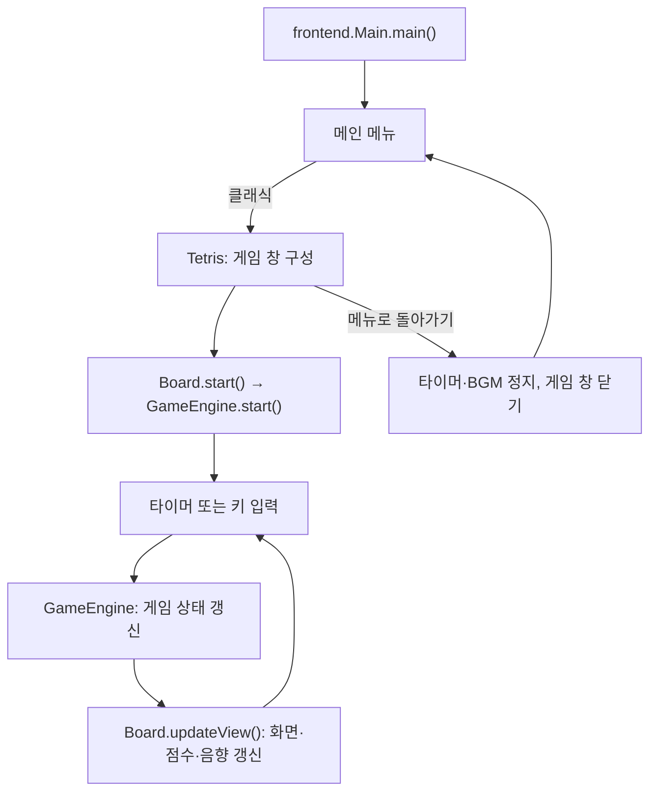

# Tetris

Java Swing으로 구현한 데스크톱 테트리스입니다. 소스코드분석 프로젝트로 기존 게임의 구조를 분석하고, 화면과 게임 규칙을 분리하며 기능을 개선하고 있습니다.

## 주요 기능

- 메인 메뉴에서 닉네임을 입력하고 **적용**한 뒤 **클래식** 게임을 시작합니다.
- **멀티플레이 → AI 대전**에서 쉬움·보통·어려움·매우 어려움·지옥 중 하나를 선택합니다. 같은 블록 순서로 시간제한 없이 점수를 겨룹니다.
- **멀티플레이 → 네트워크 대전**에서 방을 만들고 방 코드를 공유하면 다른 컴퓨터와 온라인 점수 대결을 할 수 있습니다. 두 사람 모두 준비하면 3초 뒤 시작합니다.
- 클래식은 10 × 22칸 보드에서 7종의 블록을 이동·회전·낙하시켜 가득 찬 줄을 제거하는 게임입니다.
- 오른쪽 패널에 점수, 누적 제거 줄 수, 경과 시간, 다음 블록, 조작키를 표시합니다.
- 한 번에 지운 줄 수와 연속 줄 제거에 따라 점수가 오르며, 점수가 높아지면 자동 낙하 간격이 400ms에서 최대 200ms까지 짧아집니다.
- 게임 중 배경음악과 줄 제거·게임 종료 효과음을 재생합니다.
- `P` 키로 일시정지·재개하며, 일시정지와 게임 종료 상태를 보드 위에도 표시합니다.
- **메뉴로 돌아가기** 버튼을 누르면 게임 타이머와 배경음악을 정지하고 메인 메뉴로 이동합니다.
- 게임 종료 시 TCP 서버에 닉네임별 최고 점수를 저장합니다. 메인 메뉴에는 내 최고 점수, 랭킹에는 전체 플레이어의 최고 점수를 5명씩 표시합니다.
- 서버 연결이 끊기면 `.tetris/scores.properties`에 전송 대기 점수를 보관합니다. 앱 실행 중 30초 간격으로 재시도하며, 메뉴 조회와 다음 실행에서도 다시 전송합니다.
- 랭킹의 **이전·다음·새로고침** 버튼으로 다른 컴퓨터에서 올린 기록도 확인합니다. 진행 중 메뉴로 나간 게임의 점수는 저장하지 않습니다.
- 설정에서 다음 게임의 초기 크기를 선택합니다. 게임 창의 크기를 변경해도 가로·세로 비율과 블록의 정사각형 모양을 유지합니다.

## 실행 방법

### 요구 환경

- **JDK 8 이상** 및 Swing 창을 표시할 수 있는 그래픽 데스크톱 환경
- Java 코드는 외부 라이브러리나 데이터베이스 없이 JDK로 직접 컴파일합니다.
- AI 대전에는 **Python 3.11 이상과 CPU용 모델 실행 환경**이 추가로 필요합니다. GPU나 학습 서버 연결은 필요하지 않습니다.

### 터미널에서 실행하기

저장소를 내려받은 뒤 프로젝트 루트에서 실행합니다. macOS 또는 Linux 기준입니다.

```bash
mkdir -p out
find src -name '*.java' -print0 | xargs -0 javac -encoding UTF-8 -d out
cp -R src/frontend/audio out/frontend/
java -cp out frontend.Main
```

하위 폴더의 소스까지 함께 컴파일하고, 오디오 파일을 실행 경로에 복사합니다. 닉네임을 적용한 뒤 **클래식** 버튼을 누릅니다. `out/`은 컴파일 결과가 저장되는 폴더이며 Git 추적에서 제외되어 있습니다.

기본 점수 서버는 `131.186.39.107:5000`입니다. 다른 서버나 로컬 테스트 서버를 사용하려면 다음과 같이 지정합니다.

```bash
java -Dtetris.server.host=127.0.0.1 -Dtetris.server.port=5000 -cp out frontend.Main
```

클라이언트의 프로필·임시 점수 폴더는 `-Dtetris.data.dir=/원하는/폴더`로 변경할 수 있습니다. 같은 컴퓨터에서 여러 클라이언트를 시험할 때는 각각 다른 폴더를 지정합니다.

### IntelliJ IDEA에서 실행하기

1. 프로젝트 폴더를 열고 Project SDK를 설치된 JDK로 지정합니다.
2. `src`가 Sources Root인지 확인합니다.
3. `src/frontend/Main.java`의 `main()`을 실행합니다.
4. 배경음악이 나오지 않으면 빌드 출력에 `frontend/audio/*.wav`가 복사되는지 확인합니다.

게임 앱의 실행 진입점은 **`frontend.Main`**입니다. `Tetris`는 게임 창을 구성하며 별도의 `main()`은 없습니다.

### AI 대전 준비

프로젝트 루트에서 최초 한 번 실행합니다. macOS/Linux에서는 Python 3.11 이상 또는 `uv`가 필요합니다.

```bash
bash scripts/setup-ai.sh
```

Windows PowerShell에서는 Python 3.11 이상을 설치한 뒤 `powershell -ExecutionPolicy Bypass -File scripts/setup-ai.ps1`을 실행합니다.
준비가 끝나면 기존 방식으로 `frontend.Main`을 실행하고 **멀티플레이 → AI 대전**으로 들어갑니다.
프로젝트의 `.venv-ai`를 자동으로 사용합니다. 다른 Python 환경은 `TETRIS_AI_PYTHON` 환경 변수 또는
`-Dtetris.ai.python=/python/실행파일`로 지정할 수 있습니다. IDE의 작업 디렉터리가 프로젝트와 다르면
`-Dtetris.projectRoot=/프로젝트/경로`를 지정합니다.

| 난이도 | 체크포인트 | 학습 당시 180초 검증 평균 점수 |
| --- | ---: | ---: |
| 쉬움 | 200점 | 205점 |
| 보통 | 500점 | 515점 |
| 어려움 | 1,000점 | 1,850점 |
| 매우 어려움 | 5,000점 | 12,690점 |
| 지옥 | 10,000점 | 12,690점 |

체크포인트 숫자는 저장 기준이며 매 경기의 보장 점수나 점수 상한이 아닙니다. 쉬움과 보통은
초기 보드 관측 모델이며, 어려움부터 지옥까지는 후보 배치 결과를 입력하는 모델입니다.
5,000점과 10,000점 체크포인트는 모두 75,000스텝에 저장된 같은 가중치입니다. 지옥은 배치 속도를 더 높여 구분합니다.

대전은 양쪽 모두 10×22 판, 같은 난수 시드의 블록 순서, 고정 낙하 속도를 사용합니다.
자동 낙하는 양쪽 모두 400ms 간격입니다. AI는 처음에 블록당 약 1.7초, 지옥은 약 1.5초로 시작합니다.
이후 사용자가 최근 8개 블록을 놓은 간격의 중앙값을 기준으로 AI 배치 간격을 조절합니다.
사용자 간격을 0.5~6초 범위로 맞춘 뒤 일반 난이도는 85%, 지옥은 75%를 적용하고 50ms 단위로 올림합니다.
AI 목표 간격은 일반 난이도 0.45~5.1초, 지옥 0.4~4.5초입니다.
새 블록을 보고 움직이기까지 최소 300ms를 두며, 다음 배치까지 기다리는 동안에도 자동 낙하는 계속됩니다.
사용자 게임오버 후에도 AI는 마지막으로 맞춘 속도로 플레이합니다.
한 번에 1·2·3·4줄을 지우면 각각 100·300·500·800점이며 클래식의 콤보·레벨 보너스는 적용하지 않습니다.
시간제한은 없으며 화면에는 경과 시간을 표시합니다. 한쪽이 게임오버되면 남은 쪽의 점수가 더 높은 순간
즉시 승리하며 경기가 끝납니다. 남은 쪽이 동점이거나 뒤지고 있으면 계속 플레이합니다.
양쪽 모두 게임오버되면 최종 점수를 비교하고, 동점이면 무승부입니다.
`P`로 양쪽을 함께 일시정지하며 다른 창으로 이동하면 자동 일시정지합니다. 재시작은 새로운 공통 블록 순서로 시작합니다.
AI 대전 점수는 클래식 서버 랭킹에 등록하지 않습니다.

가중치는 기존 학습 모델을 그대로 사용합니다. 대전 전용 엔진에서 시간 종료 조건을 제거하고,
모델에 전달하는 남은 시간 입력은 항상 충분한 상태로 고정합니다. 위 검증 점수는 학습 당시 기록이며
시간제한을 제거한 대전의 평가 결과는 아닙니다.

## 조작키

| 키 | 동작 |
| --- | --- |
| `←` / `→` | 왼쪽 / 오른쪽으로 한 칸 이동 |
| `↑` | 왼쪽 회전 (`rotateLeft`) |
| `↓` | 오른쪽 회전 (`rotateRight`) |
| `D` / `d` | 아래로 한 칸 이동 |
| `Space` | 가능한 가장 아래 위치까지 즉시 낙하 |
| `P` / `p` | 일시정지 / 재개 |

**아래 방향키는 회전 키입니다.** 한 칸 하강에는 `D`를 사용합니다.

## 온라인 1:1 대전

1. 서버 컴퓨터에 최신 코드를 반영하고 아래의 `ScoreServer`를 실행합니다. 예전 점수 전용 서버는 업데이트해야 온라인 대전을 처리할 수 있습니다.
2. 두 컴퓨터에서 **멀티플레이 → 네트워크 대전**을 엽니다. 서버 주소와 포트는 같은 서버로 지정하고 닉네임을 입력합니다.
3. 한 사람은 **방 만들기**, 다른 사람은 전달받은 **6자리 방 코드**로 **참가**합니다.
4. 두 사람이 **준비**를 누르면 3초 카운트다운 뒤 경기가 시작됩니다. 왼쪽에는 내 보드, 오른쪽에는 상대 보드가 표시됩니다.
5. 종료 결과를 확인한 뒤 방을 나가면 새 방을 만들거나 다른 방에 참가할 수 있습니다.

두 플레이어에게 같은 순서의 블록을 제공하며, 서버가 이동·낙하·점수·승패를 계산합니다. 각 플레이어는 자신의 속도로 블록을 배치합니다.
자동 낙하는 양쪽 모두 400ms이고, 줄 점수는 클래식과 같은 10/25/40/60점에 연속 제거 콤보 10점을 추가합니다.
한 명이 게임오버되면 남은 사람은 계속 플레이할 수 있고, 종료한 상대보다 점수가 높아지는 순간 승리합니다.
둘 다 게임오버되면 점수가 높은 사람이 승리하며 동점이면 무승부입니다. 시간제한은 없습니다.

온라인 대전에서는 아이템·레벨에 따른 속도 변화·좌우 반전·일시정지를 적용하지 않습니다. 창을 다른 곳으로 옮겨도 경기는 계속됩니다.
경기 중 방을 나가거나 접속이 끊기면 남은 사람이 승리합니다. 대기 중 이탈은 방을 종료하며, 시작하지 않은 방은 10분 뒤 만료합니다.
대전 결과는 클래식 랭킹에 등록하지 않습니다. 닉네임과 방 코드를 이용한 친구 대전이며 계정 인증이나 재접속 복구는 지원하지 않습니다.

기본 서버 주소는 기존 랭킹과 같은 `131.186.39.107:5000`입니다. 현재 사용하는 역방향 TCP 터널이 이 포트를 서버 컨테이너로 전달한다면 추가 게임 포트를 열 필요가 없습니다.
서버에는 최신 Java 코드가 실행되어 있어야 합니다. 네트워크 설정과 서버 배포 여부는 실제 운영 환경에서 별도로 확인해야 합니다.

### 한 컴퓨터에서 두 클라이언트로 확인하기

서버를 실행한 뒤 서로 다른 터미널에서 아래 명령을 각각 실행합니다. 로컬 프로필 폴더를 나눠 닉네임이 섞이지 않도록 합니다.

```bash
java -Dtetris.server.host=127.0.0.1 -Dtetris.server.port=5000 -Dtetris.data.dir=.tetris/player1 -cp out frontend.Main
java -Dtetris.server.host=127.0.0.1 -Dtetris.server.port=5000 -Dtetris.data.dir=.tetris/player2 -cp out frontend.Main
```

## 프로젝트 구조

```text
src/
├── frontend/
│   ├── Main.java                 # 앱 진입점, 메인·멀티플레이·랭킹·설정 메뉴
│   ├── Tetris.java               # 게임 창, 비율 유지, 메뉴 복귀
│   ├── Board.java                # 입력·타이머·보드 렌더링·상태 표시
│   ├── SidePanel.java            # 점수·시간·제거 줄·다음 블록·조작키
│   ├── BlockPainter.java         # 공통 블록 색상과 그라데이션 렌더링
│   ├── Shape.java                # 블록 좌표와 회전 연산
│   ├── Tetrominoes.java          # 빈 칸과 7종 블록의 열거형
│   ├── GameSettings.java         # 선택한 게임 창 크기
│   ├── Resolution.java           # 작게·보통·크게 크기 설정
│   ├── ScoreManager.java         # 서버 점수 동기화·비동기 조회·재전송
│   ├── SoundManager.java         # 배경음악·효과음 재생
│   ├── audio/                    # WAV 오디오 리소스
│   ├── ai/                       # AI 난이도 선택·두 보드 대전 화면
│   ├── online/                   # 온라인 방 생성·참가·준비·두 보드 대전 화면
│   ├── style/
│   │   └── Style.java            # 공통 폰트·화면 색상·버튼 스타일
│   ├── engine/
│   │   └── GameEngine.java       # 게임 상태·점수·충돌·고정·줄 제거
│   ├── score/
│   │   └── LocalScoreStore.java  # 닉네임·로컬 최고 점수·전송 대기 기록
│   └── network/
│       ├── ScoreClient.java      # TCP 점수 등록·조회·랭킹 요청
│       ├── OnlineClient.java     # 온라인 경기 지속 연결·입력·상태 요청
│       └── ConnectionTestClient.java  # PING 연결 확인용 클라이언트
├── backend/
│   ├── ai/                       # Python 추론 프로세스·대전 엔진·Java 연결
│   ├── models/tetris_afterstate/  # 다섯 난이도 가중치와 모델 실행 코드
│   ├── score/
│   │   └── ScoreRepository.java  # 최고 점수 영속 저장·정렬·페이지 조회
│   └── network/
│       ├── ScoreServer.java      # 점수 요청·온라인 접속을 구분하는 TCP 진입점
│       ├── OnlineMatchService.java # 방·서버 엔진·경기 시간·승패·연결 종료 관리
│       └── ConnectionTestServer.java # 기존 명령과 호환되는 진입점
└── shared/network/
    └── OnlineFrame.java          # 서버와 클라이언트가 공유하는 경기 스냅숏·코덱
```

`src/kr`에 있던 화면 개선은 `frontend`에 통합하고 중복 소스는 제거했습니다. 게임 규칙은 `frontend.engine.GameEngine`, 화면과 입력은 `frontend`에서 관리합니다. 엔진은 `frontend`의 `Shape`와 `Tetrominoes`를 사용합니다.

### 실행 흐름



## 현재 구현 범위

- 클래식, 아이템, 1PC 2인, 5단계 AI 대전, 온라인 1:1 점수 대전, 서버 점수·전체 랭킹, 해상도 설정, 오디오, 메뉴 복귀를 지원합니다.
- 온라인은 방 코드로 연결하는 친구 대전입니다. 공개 자동 매칭·공격 줄·관전·재접속 복구는 구현되어 있지 않습니다.
- 서버는 파일 기반 점수 저장소와 메모리의 대전 방을 사용합니다. 계정 인증과 DB 연동은 아직 없습니다.
- 홀드, 고스트 블록, 벽 차기(Wall Kick)는 구현되어 있지 않습니다.

## 서버 점수 저장과 운영

### 점수 서버 실행

위의 컴파일을 마친 뒤 서버 컴퓨터에서 실행합니다. 서버에는 그래픽 환경이 필요하지 않습니다.

```bash
java -cp out backend.network.ScoreServer 5000 server-data
```

서버 배포용 JAR만 만들려면 프로젝트 루트에서 `bash scripts/build-server.sh`를 실행합니다.
생성된 `out/tetris-server.jar`를 서버로 복사한 뒤 `java -Djava.awt.headless=true -jar tetris-server.jar 5000 server-data`로 실행할 수도 있습니다.
배포 시 기존 Java 서버를 정상 종료한 뒤 새 버전을 실행하고, `server-data`는 기존 저장 폴더를 그대로 지정합니다.

서버는 `0.0.0.0:5000`에서 접속을 받고 `server-data/scores.tsv`에 저장합니다. 첫 번째 인자는 포트, 두 번째 인자는 저장 폴더입니다. 기존 `backend.network.ConnectionTestServer` 실행 명령도 점수 서버로 연결됩니다.

현재 개인 서버의 작업 폴더는 `/home/samuel/server/tetris-network-check`이며, 점수는 그 아래 `server-data/scores.tsv`에 저장됩니다. 해당 작업 폴더는 Docker 볼륨에 연결되어 있습니다. 다른 배포 환경에서도 저장 폴더를 볼륨에 연결해야 컨테이너를 교체할 때 기록을 유지할 수 있습니다.

2026-10-10에는 `releases/online-20261010-01/tetris-server.jar`로 온라인 지원 서버를 반영했습니다.
같은 작업 폴더에서 `java -Djava.awt.headless=true -jar releases/online-20261010-01/tetris-server.jar 5000 server-data`로 실행합니다.
이전 `out/` 실행 파일과 배포 시점 점수·로그 백업은 보존했습니다. 새 배포가 있으면 실제 실행 중인 버전과 저장 경로를 먼저 확인합니다.
배포 당일 외부 주소에서 두 클라이언트의 방 생성·참가·준비·조작·승패와 랭킹 조회를 확인했으며, 기존 점수 파일 해시는 배포 전후 동일했습니다.

점수 파일 보존과 Java 프로세스 자동 실행은 별개입니다. 현재 컨테이너의 시작 명령은 SSH 서버이므로 컨테이너를 재시작하면 점수 서버도 다시 실행해야 합니다. 자동 실행은 서버 노트북의 Docker 시작 설정에 위 명령을 등록해야 합니다.

### 닉네임과 저장 규칙

- 닉네임은 문자·숫자·`_`·`-`를 사용해 1~16자로 입력합니다. 한글을 지원하고 대소문자는 구분합니다.
- 같은 닉네임은 같은 플레이어로 취급합니다. 현재는 로그인 인증 없이 닉네임으로 구분하며, 클라이언트가 보낸 점수를 저장합니다.
- 더 높은 점수만 갱신합니다. 낮은 점수나 같은 점수를 다시 보내도 최고 점수가 내려가거나 랭킹 행이 중복되지 않습니다.
- 점수 내림차순으로 정렬하고, 동점이면 닉네임 순으로 표시합니다. 서버는 최대 10,000개의 닉네임을 저장합니다.
- 서버가 파일 저장을 마친 뒤 성공 응답을 보내며, 클라이언트는 이 응답을 받은 점수만 전송 대기 목록에서 제거합니다.
- 서버가 꺼져 있어도 플레이할 수 있습니다. 저장에 실패하면 게임 하단에 **재전송 대기** 또는 **저장 실패**를 표시하고, 자세한 내용은 해당 상태 표시의 툴팁으로 확인합니다.
- 기존 `scores.txt`는 닉네임 정보가 없어 자동으로 업로드하지 않습니다. 파일은 보존하고 새로 플레이한 기록부터 동기화합니다.
- `.tetris/`와 `server-data/`는 Git 추적에서 제외합니다.

### TCP 요청

접속 직후 `TETRIS/1 READY`를 받고, 줄바꿈으로 끝나는 요청 하나를 전송합니다. 닉네임 토큰은 NFC로 정규화한 UTF-8 닉네임의 패딩 없는 URL-safe Base64입니다.

| 요청 | 응답 |
| --- | --- |
| `PING` | `PONG` |
| `BEST <닉네임 토큰>` | `BEST <최고 점수>` |
| `SUBMIT <닉네임 토큰> <점수>` | `OK <저장된 최고 점수>` |
| `RANKING <시작 위치> <개수>` | `RANKING <전체 인원> <응답 개수>`, `ROW <순위> <닉네임 토큰> <점수>` 행들, 마지막 `END` |

랭킹 시작 위치는 0부터이며 한 번에 1~100명을 조회합니다. 잘못된 요청은 `ERROR <오류 코드>`로 응답합니다. 기존 연결 확인도 그대로 사용할 수 있습니다.

```bash
java -cp out frontend.network.ConnectionTestClient 131.186.39.107 5000
```

### 온라인 프로토콜

기존 배너 `TETRIS/1 READY` 뒤 첫 요청을 `ONLINE/1 CREATE <닉네임 토큰>` 또는
`ONLINE/1 JOIN <방 코드> <닉네임 토큰>`으로 보내면 지속 연결로 전환합니다. 이후 `POLL`, `READY`,
`INPUT LEFT|RIGHT|ROTATE_LEFT|ROTATE_RIGHT|SOFT_DROP|HARD_DROP`, `LEAVE`를 한 줄씩 요청합니다.
각 요청에 서버가 한 줄의 `ONLINE/1 STATE ...` 스냅숏을 응답하며 두 보드와 점수, 준비 상태, 승패를 포함합니다.
`LEAVE`의 응답은 `ONLINE/1 BYE`이고 오류는 `ERROR <코드>`입니다. 상세 필드와 검증은 `shared.network.OnlineFrame`에 있습니다.

대전은 최대 16개 방과 32개 접속을 사용하며 점수 요청과 별도 작업 풀에서 처리합니다.
클라이언트는 응답 후 50ms 간격으로 상태를 조회하지만 실제 중력은 서버 타이머가 독립적으로 진행합니다.
클라이언트의 연결과 응답 제한은 각각 8초이고, 입력은 최대 4개를 1초 동안 보관합니다. 네트워크 지연에 따라 화면과 입력 반영은 늦어질 수 있습니다.
15초 동안 요청이 없는 연결은 정리합니다. 방과 경기는 메모리에 있어 서버를 재시작하면 종료되며, 저장된 클래식 점수는 유지됩니다.

### 네트워크 회귀 검증

```bash
find src tests -name '*.java' -print0 | xargs -0 javac -encoding UTF-8 -d out
java -cp out shared.network.OnlineFrameTest
java -Djava.awt.headless=true -cp out online.OnlineNetworkTest
java -Djava.awt.headless=true -cp out frontend.online.OnlineUiTest
```

네트워크 테스트는 임시 저장 폴더와 빈 로컬 포트에서 별도 서버를 실행하므로 실제 개인 서버의 랭킹을 수정하지 않습니다.
그래픽 데스크톱에서는 `java -cp out online.OnlineSwingIntegrationTest`로 실제 창 두 개의 메뉴·입력·복귀를 확인합니다.
배포 서버 확인은 `java -cp out online.OnlineServerSmokeTest 서버주소 포트`로 실행합니다. 임시 대전 방만 생성·정리하고 기존 점수는 조회만 수행합니다.

## 개발 시 참고

- 게임 규칙을 수정할 때는 `GameEngine`, 입력·타이머·화면 동작은 `Board`를 먼저 확인합니다.
- 공통 화면 색상·폰트·버튼은 `Style`, 블록 색상과 그리기는 `BlockPainter`에서 관리합니다.
- `Shape`는 네 칸의 상대 좌표를 저장합니다. 고정된 보드는 1차원 배열이며, `(x, y)` 좌표는 `y * BOARD_WIDTH + x`로 접근합니다.
- 향후 분리하면 좋을 메뉴 패널, 타이머 관리, 보드 렌더링, 키 안내 관리는 해당 코드에 주석으로 남겨 두었습니다.
- 변경 후에는 컴파일과 함께 메뉴 이동·설정·랭킹·이동·회전·낙하·줄 제거·일시정지·게임 종료·창 크기 변경을 확인합니다.
